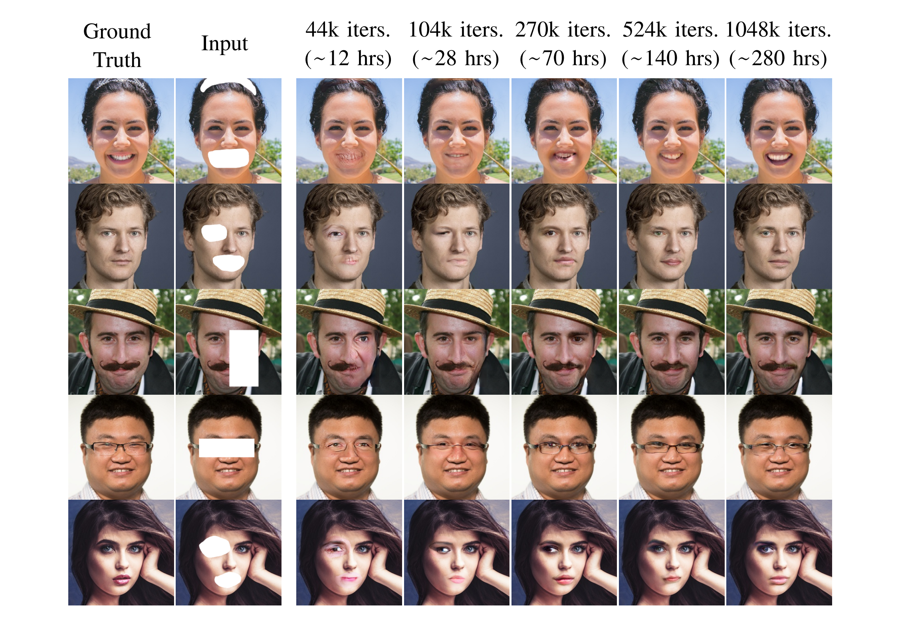
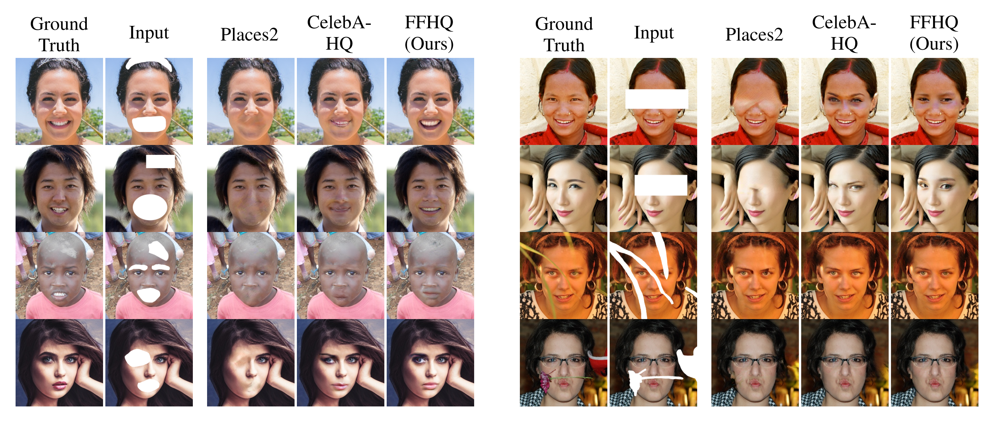

# Completing Face Pictures: a Study on Image and Facial Inpainting Methods

This project was my Graduation Thesis, which I presented in 2021 at the Polytechnic School of the University of São Paulo (Poli-USP) to attain my B.Eng. degree in Mechatronics Engineering.

- [Graduation Thesis](/Thesis.pdf)
- [Article version](/Article.pdf)
- [Presentation Video](https://youtu.be/UBtx8c31BuY) [in Portuguese]

## Run
For detailed instructions on training and testing the DeepFillv2 model, please refer to the original repository at: https://github.com/JiahuiYu/generative_inpainting

## Implementation

### Dataset
This project used the FFHQ dataset resized to 256x256 pixels, downloaded from Kaggle's ["Flickr-Faces-HQ Dataset (Nvidia) - Resized 256px"](https://www.kaggle.com/xhlulu/flickrfaceshq-dataset-nvidia-resized-256px) repository. This dataset has a size of approximately 2GB and consists of 70,000 face images, which were split into two groups: 60,000 for the training process and 10,000 for the model validation.

To train the DeepFillv2 model, images `00000.jpg` to `59999.jpg` were placed in `./training_data/training/` and images `60000.jpg` to `69999.jpg` were placed in `./training_data/validation/`. Files [`train_shuffled.flist`](./data_flist/train_shuffled.flist) and [`validation_shuffled.flist`](./data_flist/validation_shuffled.flist) were created using [`file-list-generator.py`](./file-list-generator.py), as explained in [this discussion](https://github.com/JiahuiYu/generative_inpainting/issues/15).

### Model Training

- The training process was carried out in the Google Colab platform, with the Pro+ subscription
- The DeepFillv2 model was trained for a total of 280 hours, which corresponded to 1,048,000 iterations or 262 epochs (1 epoch = 4,000 iters.)
- The utilized servers were equipped with NVIDIA's Tesla P100 PCIe GPU with 16GB of memory, and average GPU memory usage was 10.5GB
- The utilized servers had either 13.6GB or 54.8GB of RAM, depending on the assigned runtime. The average RAM usage was 10.0GB when using a runtime with 13.6GB of RAM, and 6.24GB when using a runtime with 54.8GB of RAM
- On average, the training procedure computed 1.04 batch per second, with batch size of 16 images
- The utilized Tensorflow version was 1.15.0.

Please refer to the [`inpaint.yml`](/inpaint.yml) file for details on the training parameters used in this project's implementaion.

### Pretrained Model
The weights from the DeepFillv2 model pretrained on the FFHQ dataset for this project are available at [`./logs/model_ffhq_256`](./logs/model_ffhq_256)

## Results

### Model Progress during Training
<p align="center">
  
</p>

### Models Comparison
<p align="center">
  
</p>


## Citing
This repository:
```
@misc{PedroAntonacio2021,
    author={Pedro Orii Antonacio},
    title={Completing Face Pictures: a Study on Image and Facial Inpainting Methods},
    month={Dec},
    year={2021},
    publisher={GitHub},
    howpublished = {\url{https://github.com/PedroAntonacio/facial-inpainting}}
}
```

Graduation Thesis:
```
Soon to be added
```

## License
MIT